<p align="center">
  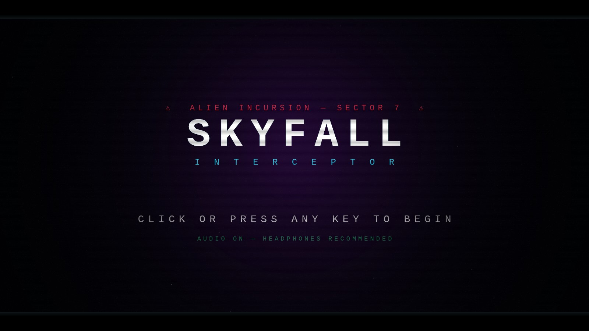
</p>

<p align="center">
  <b>A single-file synthwave boss-rush flight shooter.</b><br>
  No engine. No assets. No dependencies. Every pixel drawn and every note synthesized in code, live, in your browser.
</p>

<p align="center">
  
  
  
  
</p>

> `> INCOMING TRANSMISSION —— SIGNAL DEGRADED —— DECRYPTING…`
> `> ORBITAL GRID ANNIHILATED. HIVE FLEET DESCENDING ON SECTOR 7.`
> `> EVERY OTHER WING IS ASH. YOU ARE THE LAST BIRD IN THE AIR. GO.`

---

## ▶ Play

**The whole game is one HTML file.** Grab [`index.html`](index.html), open it in a browser, done — it runs from disk, offline, no server, no install. Audio, models, terrain, the intro film: all generated at runtime.

For development, serve the repo with any static server and open `dev.html` (the readable ES-module version of the same game):

```sh
python3 serve.py          # then http://localhost:8123/dev.html
```

Rebuild the single-file bundle with [esbuild](https://esbuild.github.io/):

```sh
node build.js --minify    # emits index.html
```

*(Fork tip: enable GitHub Pages on this repo and the game is instantly hosted.)*

## Controls

| Input | Action |
|---|---|
| `W A S D` | Fly |
| `Click` (hold) | Guns |
| `Space` | Missile |
| `Shift` | Boost |
| `A A` / `D D` | Barrel roll |
| `P` / `Esc` | Pause |

---

## The run

Boss after boss. The pacing director keeps the breathers short and the capital ships coming — your first boss lands inside the opening minute, and a good run chains a dozen more.

<p align="center">
  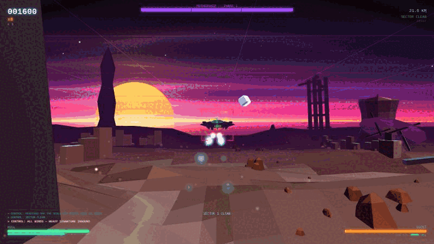
</p>

**Thirteen bosses on rotation**, each with its own machinery: the **MOTHERSHIP**'s bolt volleys · the **HIVE CARRIER** birthing escorts from its bays · **VESPER** the bat, figure-eighting into a screeching dive · the **DREADNOUGHT**'s telegraphed lance · the **PHANTOM**, a teleporting blade-ship · the **HIVE MOTHER**, the intro film's jelly grown colossal · the **HEDRA**, a tumbling crystal lattice · the **GOLIATH**, whose death is only stage one · the **ARBALEST**'s locked beam column · the **WARDEN**'s rotating pinwheel · the **REAPER**'s crossing bolt-curtains · the **HUNTER-KILLER** that stalks your lane · and the **LEVIATHAN**, which gives birth mid-fight.

And then the sky itself turns hostile:

<p align="center">
  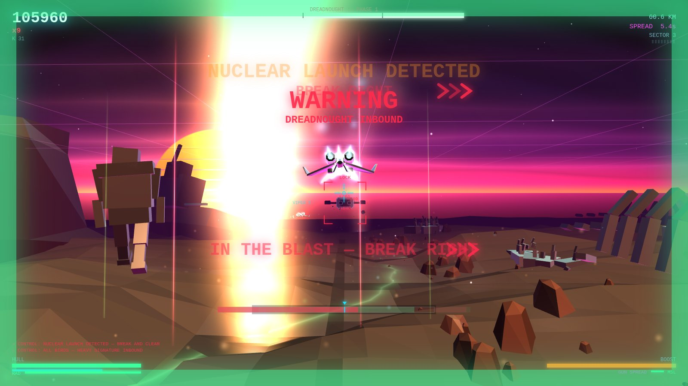
</p>

**Nuclear strikes fall ahead of you** — tactical rounds, then hydrogen rounds — leaving lethal columns of fire you fly *around*, with break calls punched through the whiteout and a Geiger crackle as the fallout climbs. Wingman flights join mid-run, fight beside you, and die on-screen. Weapon crates, combo multipliers, radio chatter, a persistent service record. The synth score escalates with the threat and shifts into a darker mode when a boss takes the stage.

<p align="center">
  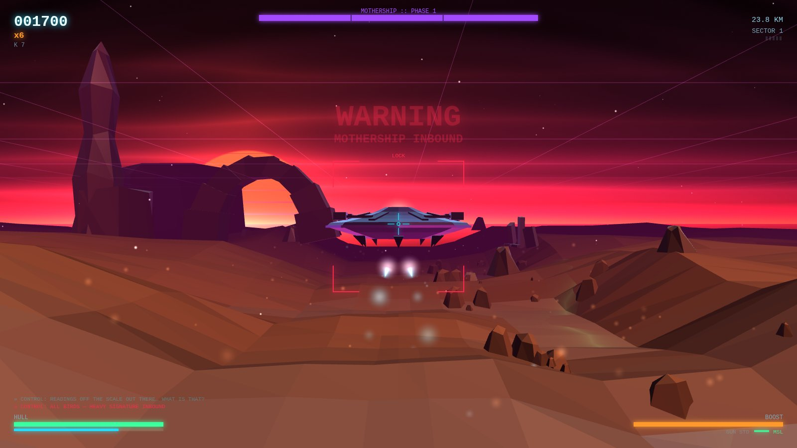
</p>

---

## The opening

A full in-engine title sequence — six scenes, thirty-five seconds, drawn frame-by-frame on a 2D canvas with matte bars, film grain and cut dips — that hands off seamlessly into your first sortie. Skippable, of course. But why would you.

<p align="center">
  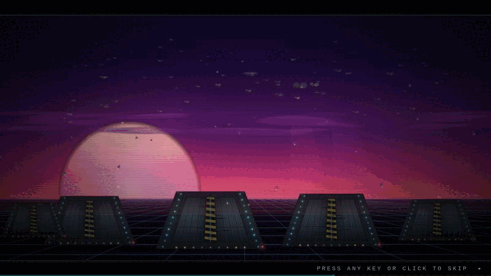
</p>

| | |
|---|---|
| 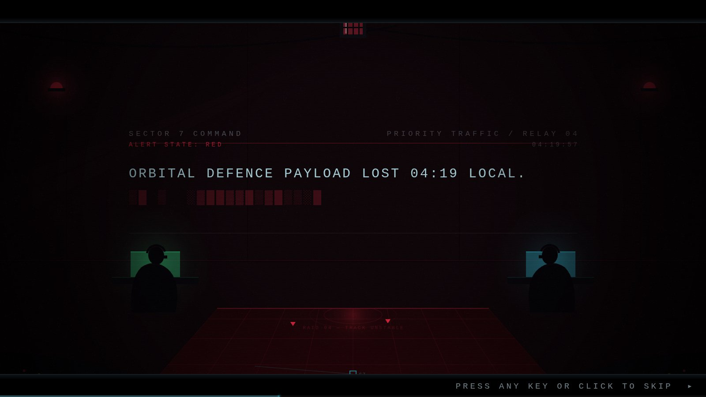 | 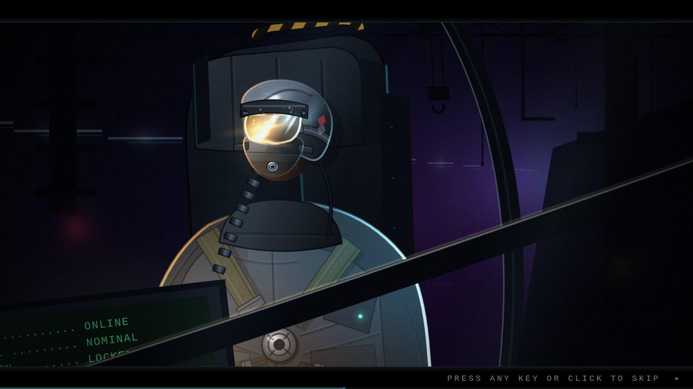 |
| 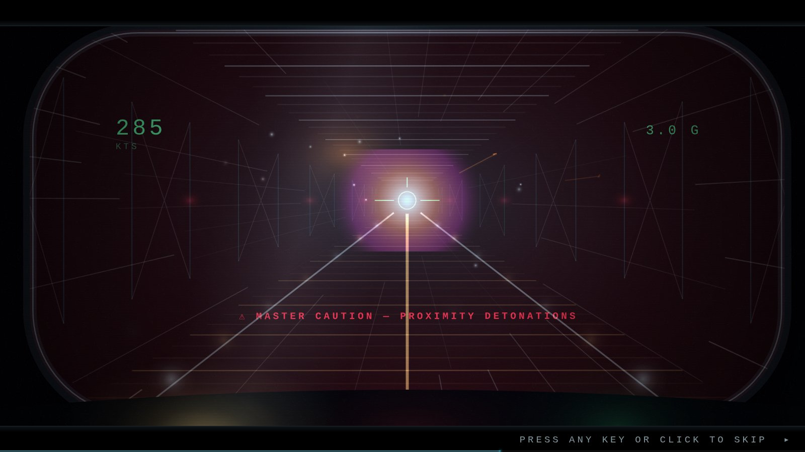 | 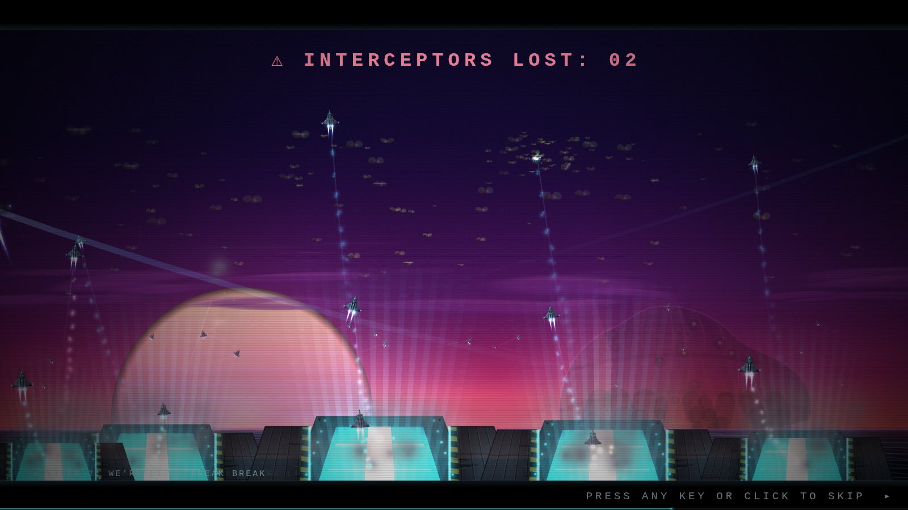 |
| 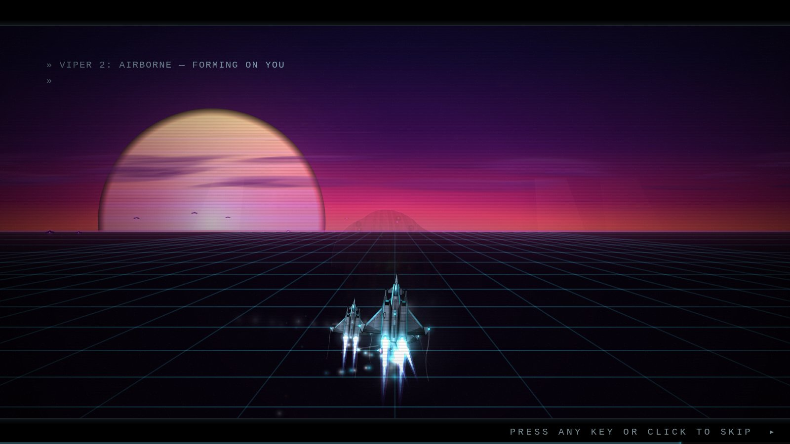 | 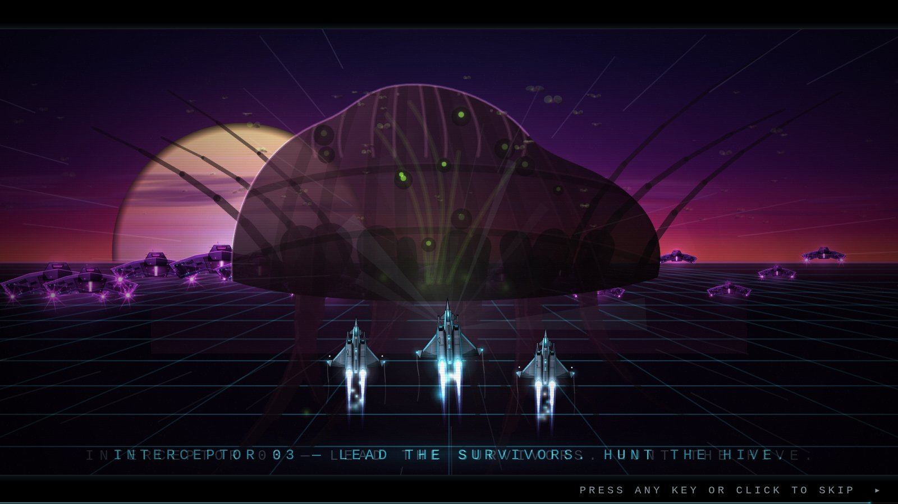 |

---

## Under the hood

- **Vanilla ES modules, zero dependencies.** `dev.html` loads ~40 modules; `build.js` (esbuild) folds them into one minified, self-contained `index.html`.
- **Raw WebGL renderer** — flat-shaded procedural terrain, canyon arches, alien creep, wrecked warships; per-boss entrance heralds; nuclear detonations that keep lighting the deck for seconds after the flash clears.
- **Procedural audio** — every laser, boom and Geiger tick synthesized in WebAudio; the soundtrack is a live sequencer with bar-crossfades, sidechain pump, and a phrygian ♭9 boss mode.
- **The cinematic engine** — six scene modules over a shared 2D-canvas state, cached glow sprites, an O(1)-compaction particle pool, and a presentation stack (grain, vignette, chromatic flash echo, rotational camera hits) composited in window space.
- **A pacing director** — sectors, threat budgets, lull windows, boss scheduling at *death* sites (so payouts can't chain bosses), and a nuke scheduler that knows when the spectacle budget is already spent.

Everything in [`media/`](media/) is captured straight from the engine.
